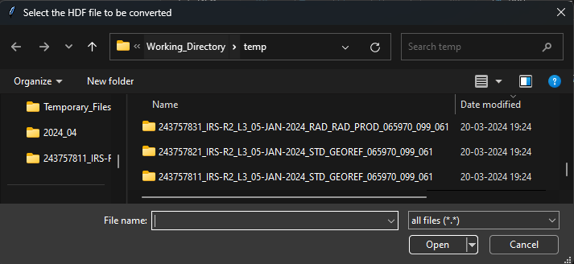
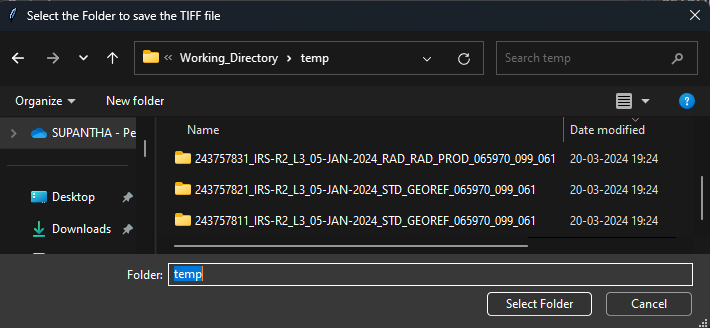
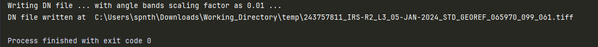

# Resourcesat-PreProcessor
Task: Converting the HDF Product to Georeferenced TIFF.

This is applicable for the dataset of IRS Satellite Resourcesat Series which comprises of Resourcesat-2 and Resourcesat-2A Satellites.

## Running the Program:
- Run the file 'main.py' [click here](main.py)
- Select the '.h5' product path from the gui as follows:

- Select the folder path where to save the '.TIFF' file from the gui as follows:

- The code will run and then output will be as follows in the console:

## Band Sequence
The Band Sequence for LISS-3 and  sensor is as follows:
1. BAND2 
2. BAND3
3. BAND4
4. BAND5
5. Sun_Azi
6. Sun_Zn
7. Sat_Azi
8. Sat_Zn

The Band Sequence for LISS-4 sensor is as follows:
1. BAND2 
2. BAND3
3. BAND4
4. Sun_Azi
5. Sun_Zn 
6. Sat_Azi 
7. Sat_Zn

## Data Formats and Scaling Factors:
The Data formats for the bands are as follows:
- All Bands : 16 bit Unsigned Integer

The Scaling Factors are as follows:
- Band2, Band3, Band4 and/or Band5 : 1
- Sun_Azi, Sun_Zn, Sat_Azi, Sat_Ele : 0.01