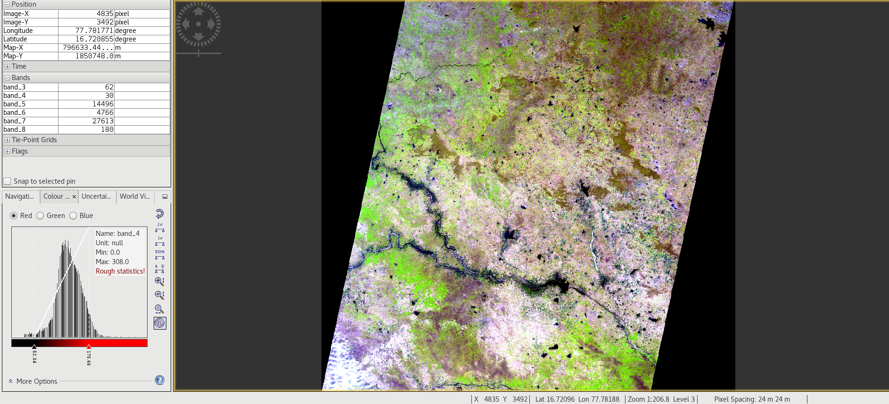
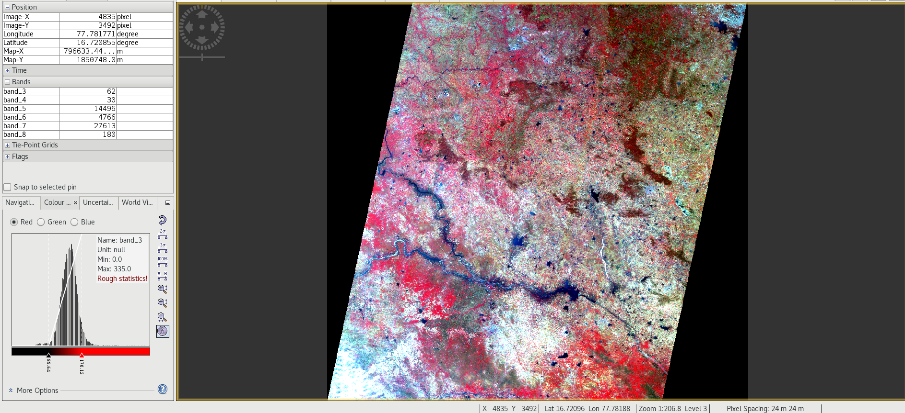

# Resourcesat-PreProcessor
Task: Converting the HDF Product to Georeferenced TIFF.

This is applicable for the dataset of IRS Satellite Resourcesat Series which comprises of Resourcesat-2 and Resourcesat-2A Satellites.

## Running the Program (Single Mode):
- Run the file 'main.py' [click here](main.py)
- Select the '.h5' product path from the gui as follows:

- Select the folder path where to save the '.TIFF' file from the gui as follows:

- The code will run and then output will be as follows in the console:

## Running the Program (Batch Mode):
- Run the file 'main_batch.py' [click here](main_batch.py)
- Select the directory where all the product folders (which contains the 'BAND.h5' and 'BAND_META.txt' file) are present from the gui as follows:

- Select the folder path where to save the '.TIFF' files from the gui as follows:

- The code will run and then outputs will be as follows in the console:

## Band Sequence
The Band Sequence for LISS-3 and AwiFs sensor is as follows:
1. BAND2 
2. BAND3
3. BAND4
4. BAND5
5. Sun_Azi
6. Sun_Zn
7. Sat_Azi
8. Sat_Zn

The Band Sequence for LISS-4 sensor is as follows:
1. BAND2 
2. BAND3
3. BAND4
4. Sun_Azi
5. Sun_Zn 
6. Sat_Azi 
7. Sat_Zn

## Data Formats and Scaling Factors:
The Data formats for the bands are as follows:
- All Bands : 16 bit Unsigned Integer

The Scaling Factors are as follows:
- Band2, Band3, Band4 and/or Band5 : 1
- Sun_Azi, Sun_Zn, Sat_Azi, Sat_Ele : 0.01

## Sample output for Resourcesat-2 Liss-3 Product
- Natural Color Composite Image (NCC) is generated by R:BAND4, G:BAND3, B:BAND2

- False Color Composite Image (FCC) is generated by R:BAND5, G:BAND4, B:BAND3

Observe that the angle bands band_5 to band_8 in the left side of the image are to be adjusted by an scale factor of 0.1 to get the corresponding angle.
Also check the Latitude, Longitude and Map-X, Map-Y written in the left side of the image, those are generated from the transform in the code.
- Image-X, Image-Y : x, y values
- Map-X, Map-Y : Values as per the UTM projection
- Latitude, Longitude : Values in Geographic coordinates
